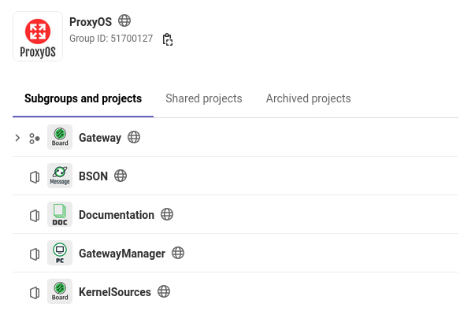

Repository structure
====================

Each repository of the project can be found at
`Gitlab <https://gitlab.com/proxyos>`_ and a mirror is available on
`Github <https://github.com/ProxyOS>`_.

If you want to use ProxyOS with a specific board, you will have to clone
at least two repositories:

* :repository:`GatewayManager <gateway-manager>` which is the PC part
  of the software.
* And a repository in the :repository:`Gateway <gateway>` group which
  correspond to the board you use. Any of these repositories has the
  :repository:`Gateway Kernel <kernel>` as submodule.
  This is due to reasons explained in :ref:`architecture:Kernel` section.

When you clone these repositories don't forget to use the options to
retrieve the submodules at the same time:

.. code-block:: bash

  git clone --recursive <url>

Otherwise you will have to perform the following command in the
repository directory after cloning it:

.. code-block:: bash

  git submodule update --init --recursive
